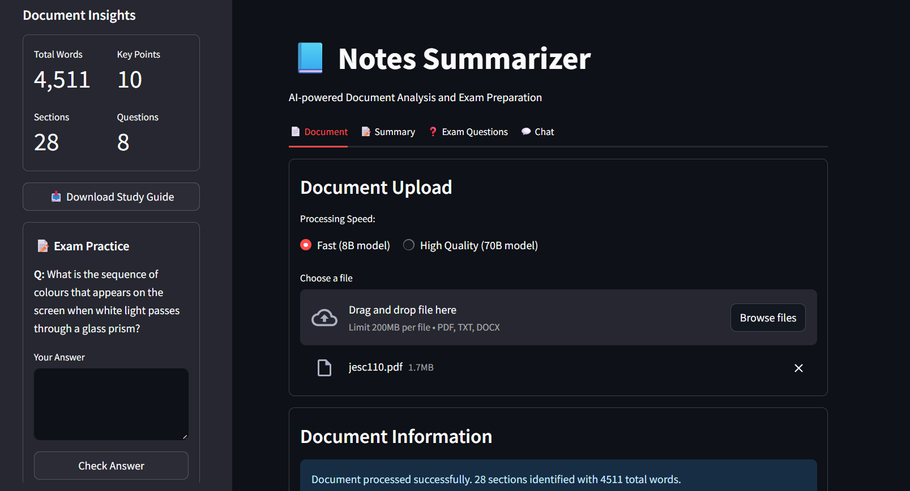
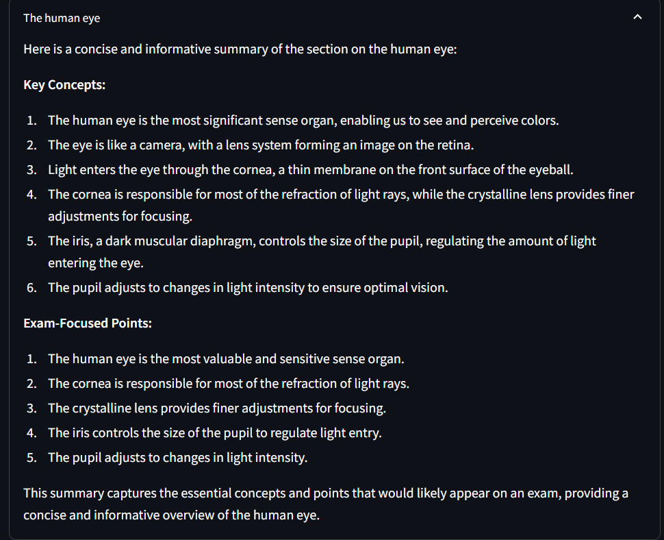
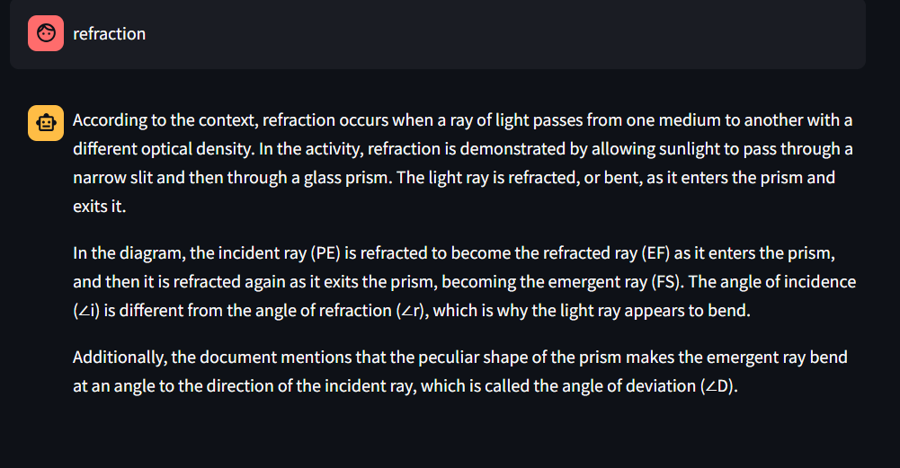

# 📝 Notes Summarizer

An intelligent, interactive note summarization and self-evaluation tool built using **Streamlit**. This app allows users to upload subject notes, generate summaries, chat with an AI assistant, receive potential questions, test their understanding, and download the final summary for offline use.

---

## 🧩 Project Overview

This application is designed for students or self-learners who want to condense and interact with large volumes of study material. The system extracts key information from user-provided notes, provides an AI chat mode for contextual questions, generates test questions, and even evaluates user answers.

---

## 🔑 Key Features

- 📚 **Notes Summarization:**  
  Upload any academic content (text or PDF) and receive a clear, concise summary.

- 💬 **Chat Mode:**  
  Ask questions about the uploaded content and get context-aware responses from the AI chatbot.

- ❓ **Potential Questions:**  
  The app automatically generates a list of questions based on the provided notes — useful for exam prep.

- 🧠 **Self-Assessment:**  
  The app presents a test question. You can answer it and receive instant feedback on correctness.

- 💾 **Download Summary:**  
  Download the generated summary, questions, and insights as a `.txt` file for revision or sharing.

---

## 💡 Impact

This tool serves as a **study companion** for students by:
- Saving time in manual note summarization  
- Enabling interactive revision via AI  
- Generating practice questions automatically  
- Promoting self-testing for better retention  
- Supporting offline study through downloadable content

---

## 🖼️ Application Screenshots & Feature Gallery

### 📝 Notes Upload and Summarization  
Add your subject notes and instantly receive a summarized version.  

---

### 📄 Summary Output  
Get a clean, structured summary that highlights key points from your content.  

---

### 💬 Chatbot Mode  
Interact with the notes through natural conversation and get AI-driven answers.  

---

### ❓ Auto-Generated Questions  
View relevant questions the system can generate based on your notes.  

---

## 📄 License

This project is open-source and available under the MIT License.

---

## 👩‍💻 Author

**Jayati Aggarwal**  
Computer Science & Engineering  
Email: aggarwaljayati58@gmail.com  
[LinkedIn](#) | [GitHub](#)

